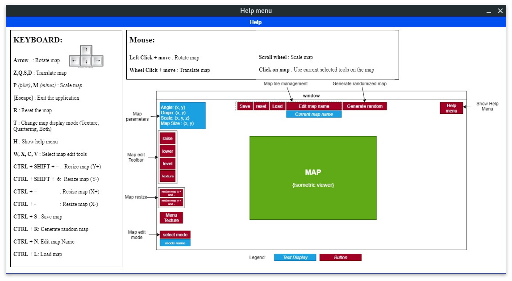
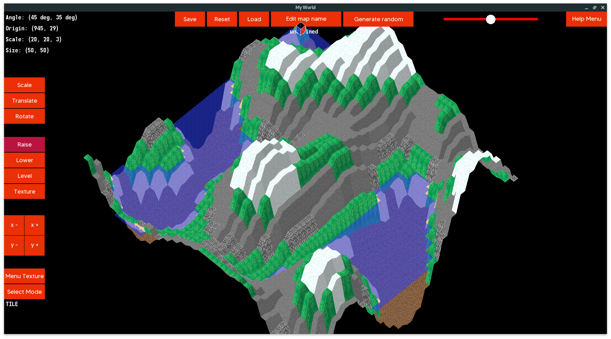
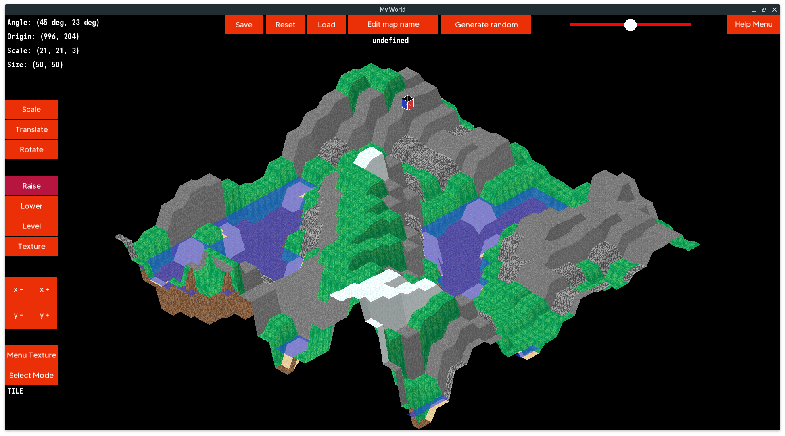
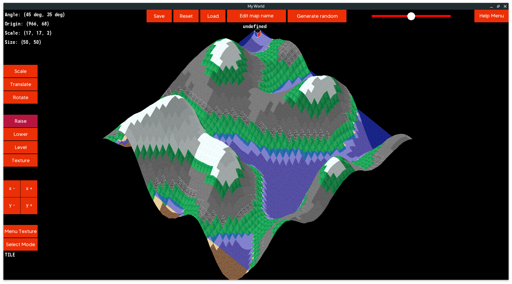
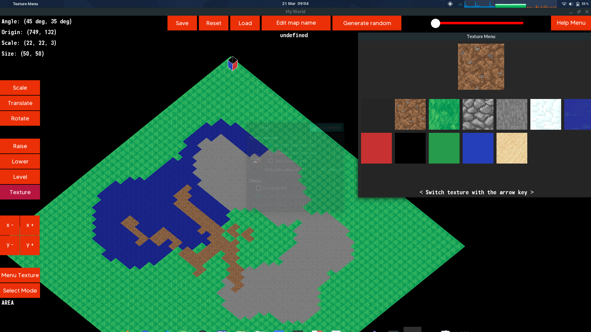
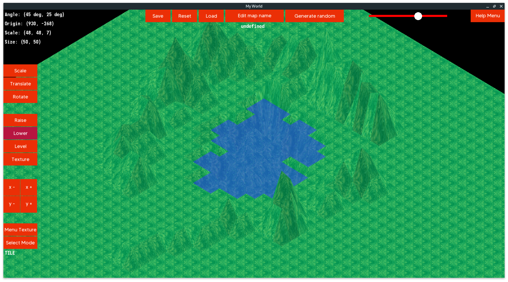

# MUL_my_world_2019

- **Usage:** make && ./my_world [.world]
- **Group Members:**
  - [@AurélienJoncour](https://github.com/aurelienjoncour)
  - [@Simon RACAUD](https://github.com/simonracaud)

# Subject

An isometric world designer written in CSFML  
Create a terraformer program.  
Display a map and edit at runtime.  

# Features
- Display a map using a 3D projection (isometric)
- Select tiles and their corners can be selected using the mouse
- Effect can be applied (modification of the tiles altitude, reset tiles atltitude, changing tiles textures)
- Brush size and scale can be change using a slider
- Zoom and move around the map
- Save and load the map at runtime
- Save and load the map with CLI
- An help windows

Shortcut and usage:

# Preview

Map Generator - Mode A:

Map Generator - Mode B:

Map Generator - Mode C:

Map Brush Tool and Texure menu:

Map edit tools : Raise, Lower, Level

 {16 February - 15 March 2020}
